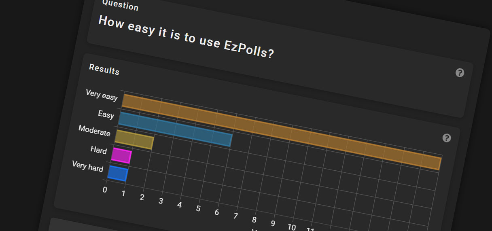
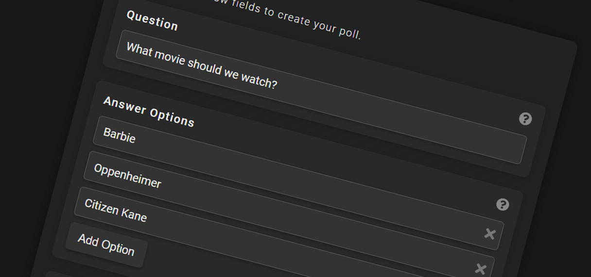

# EzPolls

A dynamic platform for instant online polling. Whether you're gauging favorite movies or conducting business surveys,
EzPolls provides an intuitive experience for creating and participating in polls. Users can swiftly create polls, cast
votes, and witness results unfold in real-time. With features like multiple voting restrictions, Google's reCAPTCHA for
enhanced security, and a user-friendly interface, EzPolls is where simplicity meets functionality.

# Live Demo

Experience real-time polling with EzPolls. Try creating a poll, voting, and watching live vote updates:

### [https://ezpolls.fly.dev/](https://ezpolls.fly.dev/)

<a href="https://ezpolls.fly.dev/">
  
</a>
<br><br>
<a href="https://ezpolls.fly.dev/">
  
</a>

## Tech Stack

- **Frontend:** React.js
- **Backend:** Java with Spring Boot
- **Database:** MongoDB
- **Deployment:** Docker, Fly.io

## Features

#### User Authentication and Profile Management

- User registration and login with JWT-based session management.
- Intuitive user interfaces for registration, login, password change, and email change.
- Input validation, error handling, and notifications for secure and seamless user interactions.
- Passwords encrypted with BCrypt for storage and never sent to the client.

#### Poll Creation and Management

- Dynamic poll creation form supporting multiple options and customizable voting restrictions.
- Display of user-created polls with easy navigation to detailed views.
- Ability to delete user-created polls with confirmation prompts.

#### Voting System

- User-friendly interface for casting and changing votes based on poll settings.
- Voting restrictions options: once per IP, once per user, or no restrictions.
- Optional reCAPTCHA verification during voting for anti-spam measures.
- Real-time updates on vote counts using Server-Sent Events (SSE).

#### Visual Data Display

- Live charts representing poll results with selectable types: Pie, Bar, Doughnut, and List.
- Automatic and immediate chart updates upon new votes.

#### Security and Anti-Spam Measures

- Google's reCAPTCHA verification integrated for user login and selected poll activities.
- Rate limiting to mitigate potential abuse in poll creation and voting.

#### Sharing and Accessibility

- Clean URLs for sharing polls and viewing results.
- Tooltips for enhanced user guidance and responsive design for various devices.

#### Frontend Infrastructure

- Modern and interactive UI developed with React.js, ensuring a smooth and intuitive user experience.
- Responsive design optimized for a wide range of devices, from mobile phones to desktop screens, ensuring consistent
  usability and aesthetics.
- Component-based architecture facilitates maintainability, reusability, and efficient state management.
- Strong focus on UX with clear notifications, visual feedback, and seamless transitions to maximize user engagement.

#### Backend Infrastructure

- Robust backend built with Java and Spring Boot, interacting with MongoDB for data storage.
- Efficient querying, custom exceptions, and advanced features ensuring optimal performance and user experience.

## Running the project locally

### With Docker

**Building the Docker Image:** First, you need to build the Docker image. Execute the following command in the root
directory of the project:

```docker build -t ezpolls .```

**Running the Docker Image:** Once the image is built, start the container with:

```docker run -p 8080:8080 ezpolls```

The project will then be accessible at http://localhost:8080.

#### Environment variables

When running the Docker container, it's essential to provide the required environment variables:

**Atlas MongoDB URI:** This is the connection string for your MongoDB database. Obtain it from your Atlas dashboard.

**Google reCAPTCHA v2 Secret:** This secret key is specific to your reCAPTCHA. Remember to also integrate the
corresponding
site key in the frontend's reCAPTCHA component.

**JWT Secret:** You can utilize any Base64-encoded string for this.

The Docker command with environment variables looks like:

```docker run -p 8080:8080 -e MONGODB_URI='your_mongodb_uri' -e RECAPTCHA_SECRET='your_recaptcha_secret' -e JWT_SECRET='your_jwt_secret' ezpolls```

### Without Docker

If you prefer not to use Docker, ensure you have Java 17, Gradle, and npm installed beforehand.

**Running the Backend:** Navigate to the backend directory and run:

```./gradlew bootRun```

**Setting up & Running the Frontend:** In the frontend directory, execute:

```
npm install
npm start
```

The frontend will then be live at http://localhost:3000.

**Note:** Don't forget to provide the environment variables for your backend. Set them like this:

```export MONGODB_URI='your_mongodb_uri'```

## Timesheet

[timesheet.md](timesheet.md)